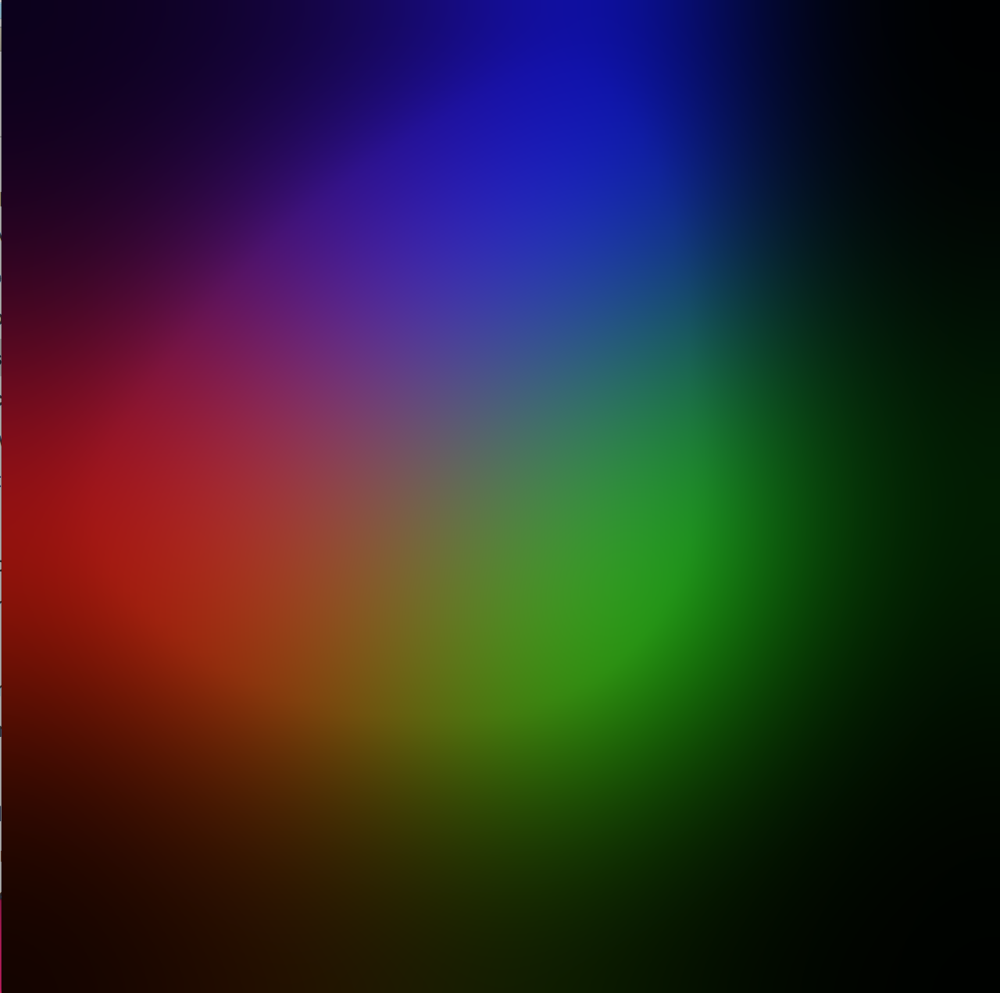
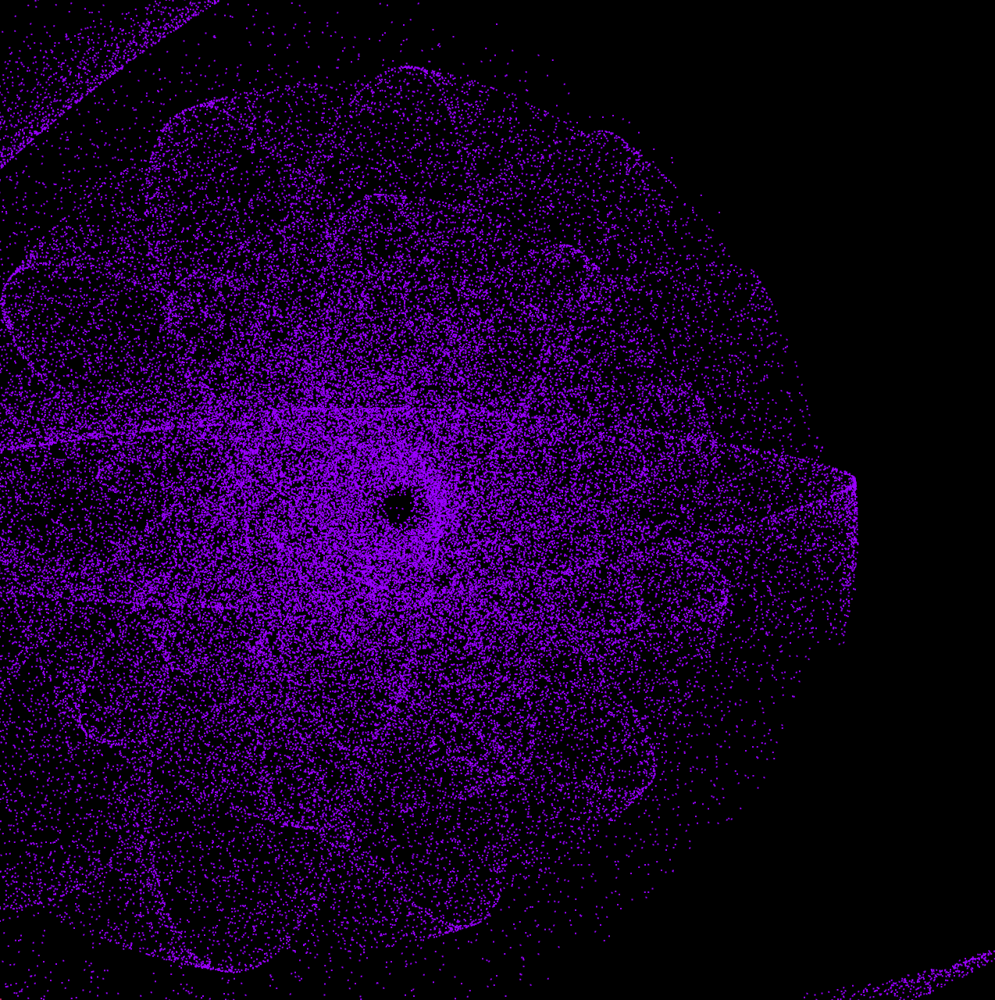
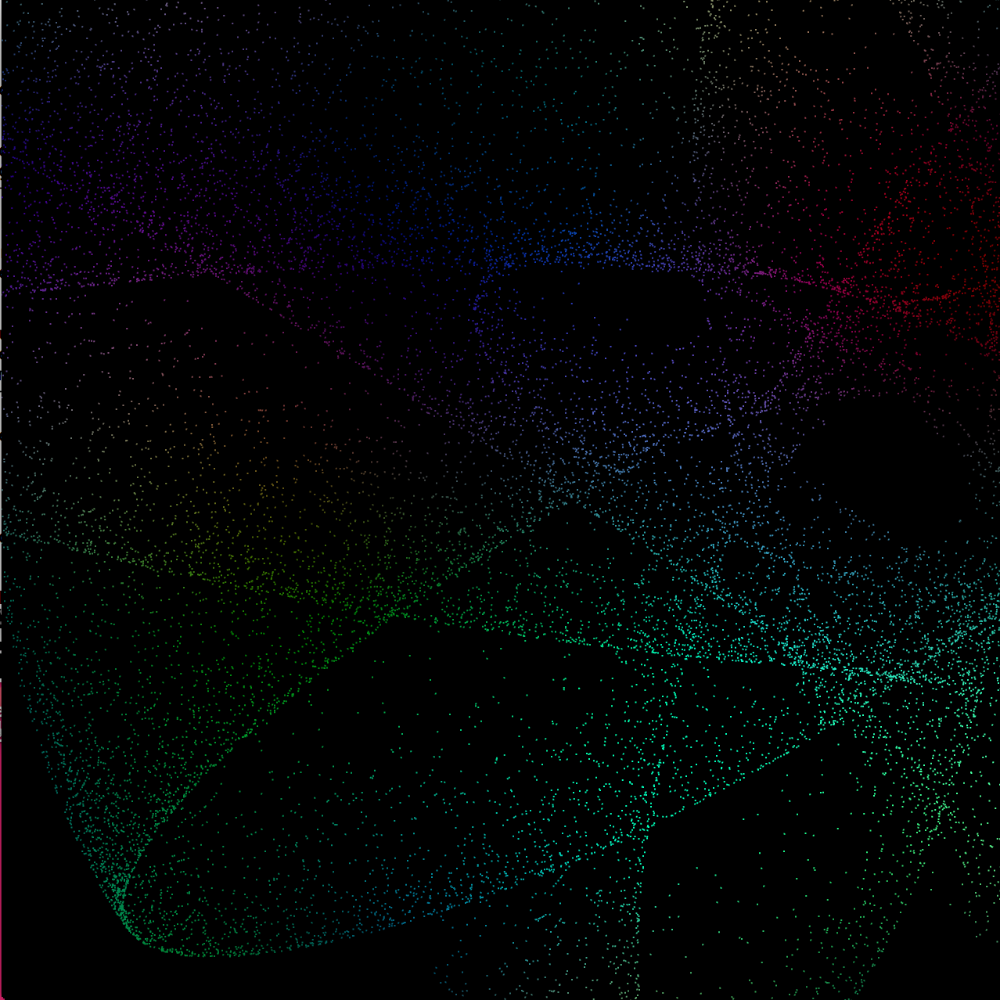
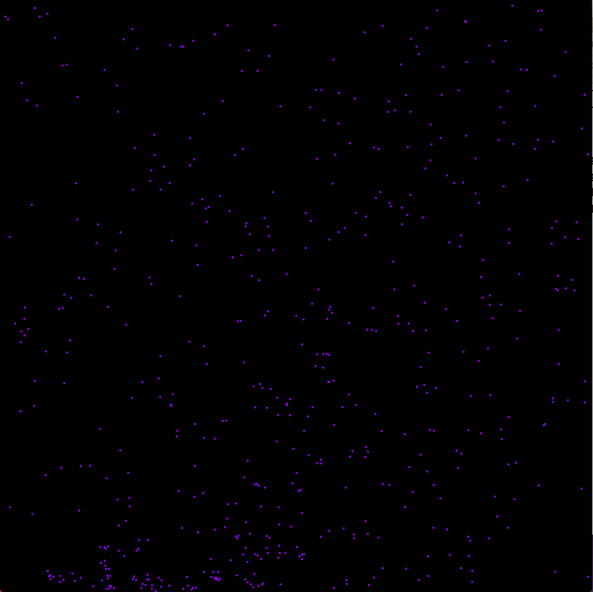
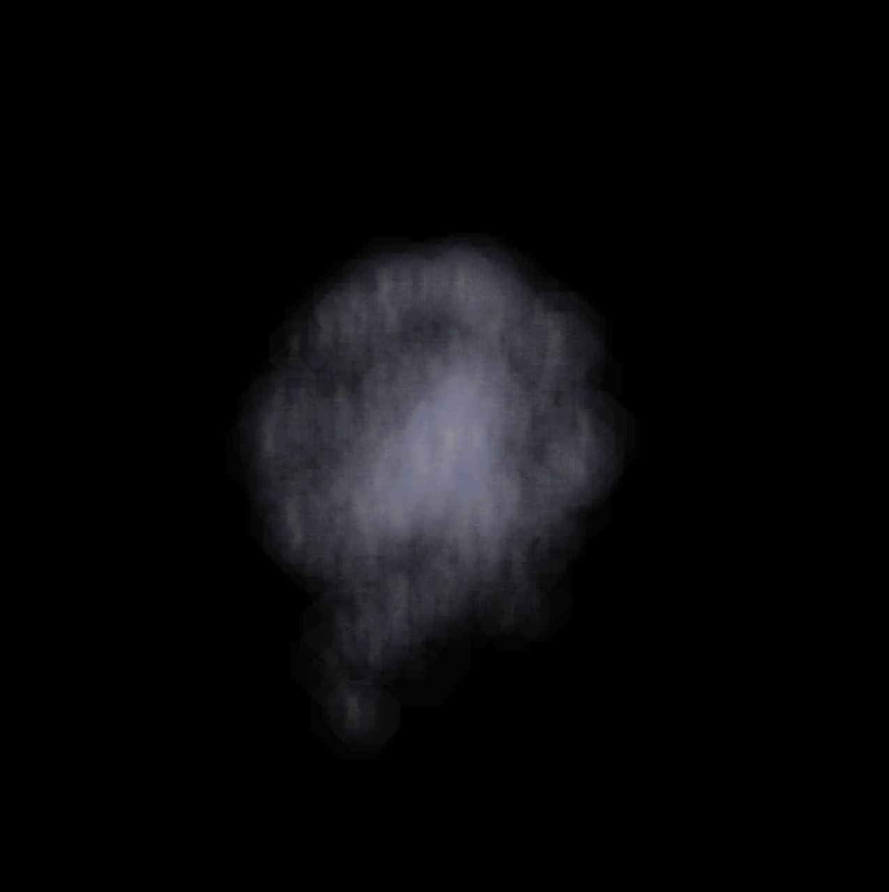
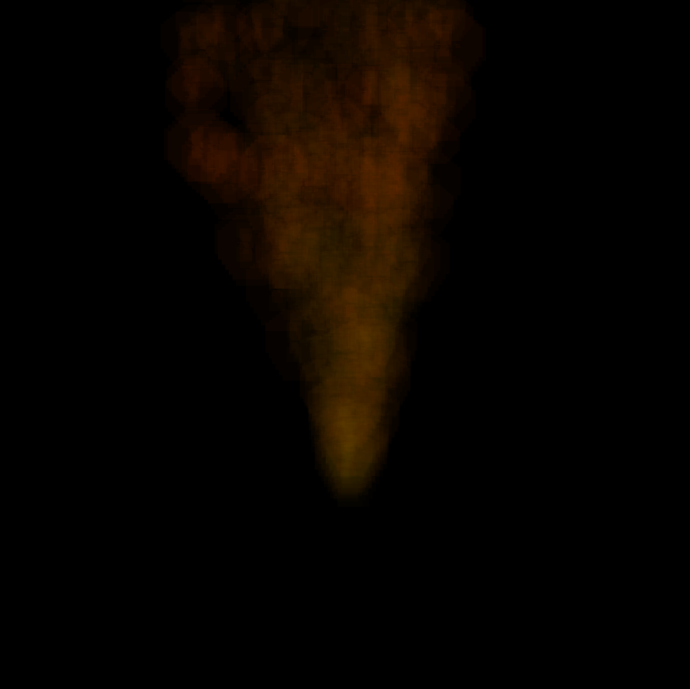
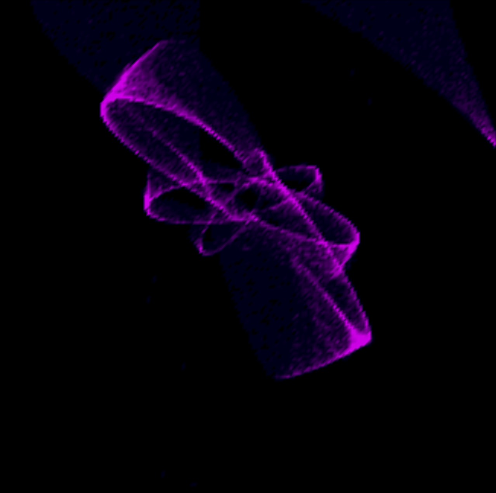
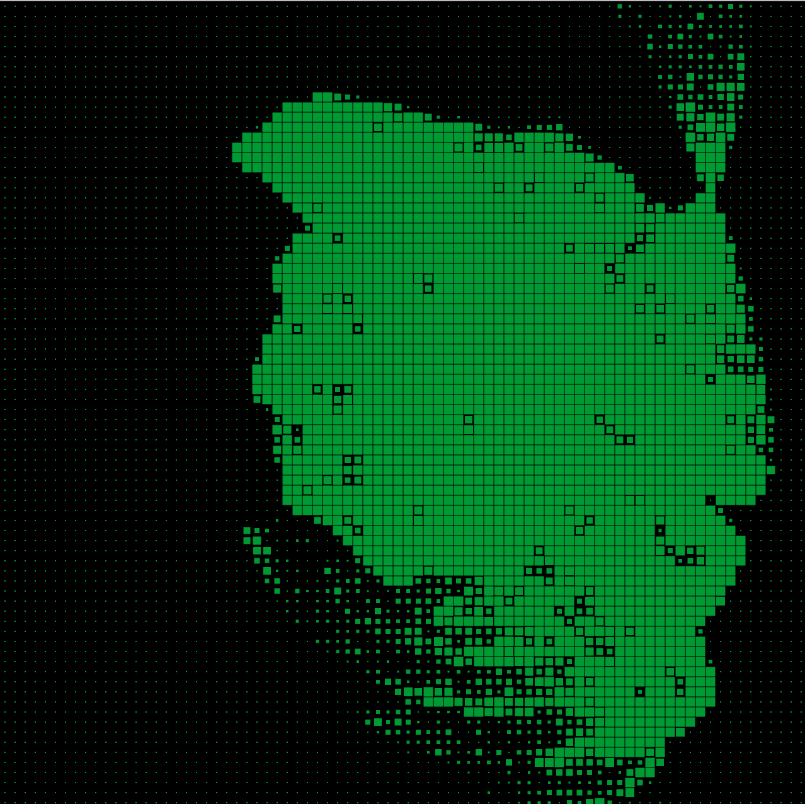

##### ThatsANiceRenderingDave
# Particle Systems
### Overview

The focus of our project was to model multiple different systems that handle many simple particles in order to achieve interesting effects. We made a couple different systems experimenting with particles, as well as systems that move towards abstracting the particles away in order to increase performance.

### The Fluid System

This system models simple fluid behaviors by using a grid structure to keep track of average densities and velocities in a cell's area. It is based on the Navier Stokes Equations and that paper by Jos Stam.

### The Space System

This is a simple system where 100,000 particles are put into a world, and each one is gravitationally attracted to a center point. When we first were making this system, we had a static origin point, which resulted in all the particles simply oscillating back and forth through the center. Giving the particles initial velocities would cause most of the particles to miss the center, and so they would orbit the center instead. Ultimently this effect appeared very similar to the simple oscillation. We also changed the center point to be equal to the average center of mass. This also turned out fairly uneventful, since a distribution of points around the screen end up having a center that almost stays the same as the original center point we were using.

The change that ended up making the system the most interesting was having the center point move in a circle. This causes the particles to be slung around the center, since their vector of acceleration is always changing. This produces the effect currently shown by our Space System.

### The Rainbow Space System

This system works the same as the Space System, however it uses a different shader which utilizes perlin noise to color the particles based on their location.

### Collision and Gravity System

This system handles simple collision between particles and the boundries of the screen. To do this we use Verlet particles, which use a previous and current position in order to determine velocity. In order to determine collisions, the system will take a step, check if anything has gone out of bounds or crossed paths, and then adjust. This may result in multiple small steps per step in order to make sure the adjustments are correct and dont cause new conflicts. The gravity of the system is just a constant downward force on all the particles.

### Smoke System

This system is a modification of the Space System. The particles are placed around the center of gravitation in order to keep the oscillation effect, and the movement of the center's circular path has been reduced. The largest difference is that a new shader has been applied to the particles. Now, each particle will generate a small cloud of particles. The cloud will deform slightly based on the movement of the particle. This collection of 500 particles, each producing a little cloud, collectively create a pretty nice looking smoke cloud. The system also has the option of acting as an emitter instead of a set number of particles floating around a point. This gives more of an outward movement to the system, as shown by the Fire System.

### Emitted Smoke (Fire) System

This is just a version of the Smoke System where it acts as an emitter instead of a cloud of particles. To achieve a simple fire effect, the emitter only will create particles with upward velocity, with a small variation of horizontal velocity. The shader used is also the same with just a slight tweak to cause the color to be more like a fire. The color is less red the faster the particle is moving, causing more of a yellow color at the base of the fire, and more red near the top where the particles have started to slow down.

### Grid System

This system acts as a layer over other systems. It divides the screen space into a grid of nodes and tracks the number of particles currently in each node as the particles move around. Since it is aware of where all the particles generally are, the shader then just has to draw squares across the screen for each node, and correctly color them based on how many particles are in each square. This allows us to run a system with many thousands of particles, but instead of having to draw each individual one, the grid just has to color its cells appropriately. This allows the system to run faster, while still being able to model all the same movement.

### Pixel Grid System

Just like the Grid System, this acts as a layer over another system. The only difference between this system and the Grid System is the shader used. Instead of drawing squares across the screen, each cell in the grid is represented by a single point. That point's size represents the number of particles in that cell of the grid.

Controls
============

The user can switch between systems by using different numbers:

    1. Fluid System
    2. Space System
    3. Rainbow Space System
    4. Collision and Gravity system
    5. Smoke System
    6. Emitted Smoke (Fire) System
    7. Grid System
    8. Pixel Grid System

#### Smoke System Controls:

    Mouse:
    	Left Click: Push particles
    	Right Click: Pull particles

#### Fluid System Controls:

    Mouse:
        Left Click : Apply Force
        Right Click : add/remove density
    
    Keys:
        R : changes active color to red 
        G : changes active color to green
        B : changes active color to blue
    
        CTRL : swaps between adding or removing dye
        
        C : clears screen
        \ : displays current settings
    
        - : reduces diffusion
        = : increases diffusion
        [ : reduces viscocity
        ] : increases viscocity
        ; : reduces force
        ' : increases force
        . : reduces amount of dye added or removed
        / : increases amount of dye added or removed
    
        a : adds an emitter at the mouse position with the current dye settings
        UP : adds Vertex emitter pointed up
        DOWN : adds Vertex emitter pointed down
        LEFT : adds Vertex emitter pointed left
        RIGHT : adds Vertex emitter pointed right

# How to build

Just like the other projects in this class, this project can be built using cmake:

    mkdir build
    cd build
    cmake ..
    make -j8
We also have helpful scripts that can be used to build and run the project.

    ./bd : builds the project
    ./bdr : builds and runs the project
    ./run : runs the built project

# Sources

Jos Stam's paper on fluid dynamics: http://www.intpowertechcorp.com/GDC03.pdf

Tutorials looking at using verlet particles for physics: https://www.youtube.com/watch?v=3HjO_RGIjCU

Particle system implementation: https://github.com/diwi/PixelFlow

Blog with some fluid and smoke simulations: http://prideout.net/blog/?p=58